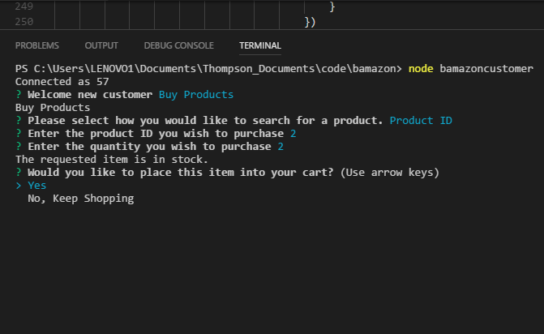
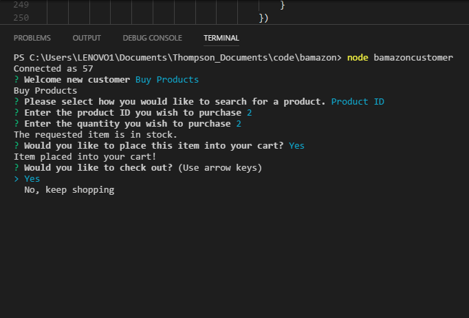

# Bamazon

## What is Bamazon?
- Bamazon is a node application which uses MySQL and Inquirer to create a mock product showcase within the command line.

## Setup
- Run NPM Install
    + This should install the following packages:
        - Inquirer
        - MySQL
        - Cli-Table

## Running the Application
- Type "node bamazonCustomer" to access the consumer application
- Type "node bamazonManager" to access the management application
- Type "node bamazonDepartment" to access the executive application

## Bamazon in Use

Customer start screen:

Screen for "View Products" select

Screen for "Buy Products" select

Screen for "Product Name" select under "Buy Products"

Screen for "Product ID" select under "Buy Products"

Screen for quantity entry following product entry

Screen for cart addition

Screen for checkout prompt

