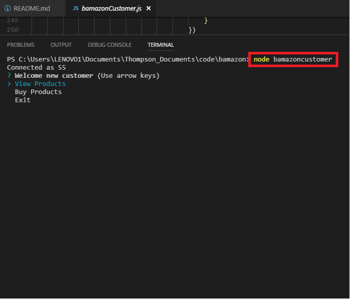
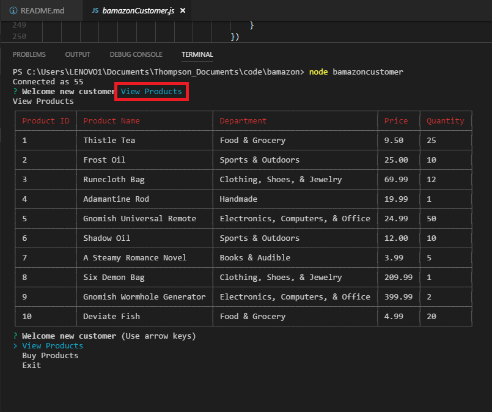
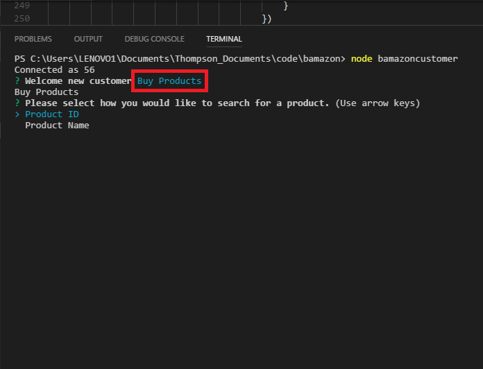
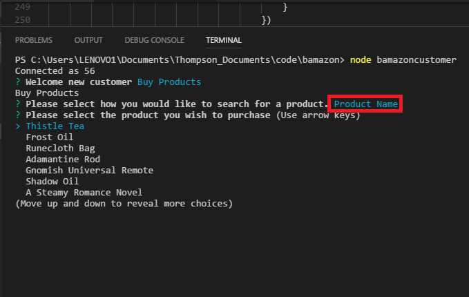
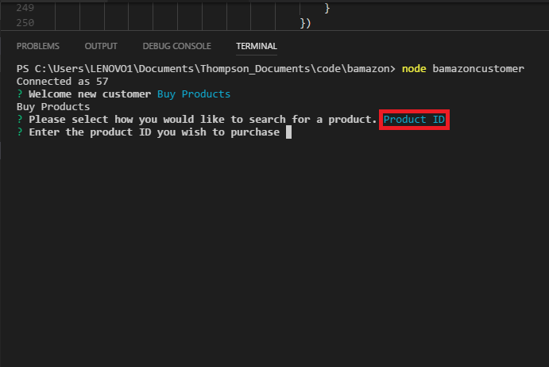
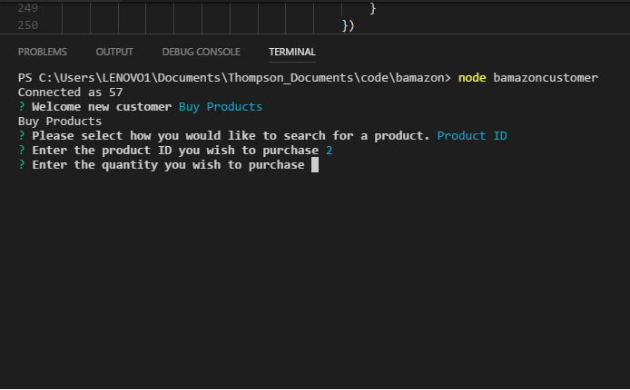

# Bamazon

## What is Bamazon?
- Bamazon is a node application which uses MySQL and Inquirer to create a mock product showcase within the command line.

## Setup
- Run NPM Install
    + This should install the following packages:
        - Inquirer
        - MySQL
        - Cli-Table

## Running the Application
- Type "node bamazonCustomer" to access the consumer application
- Type "node bamazonManager" to access the management application
- Type "node bamazonDepartment" to access the executive application

## Bamazon in Use

